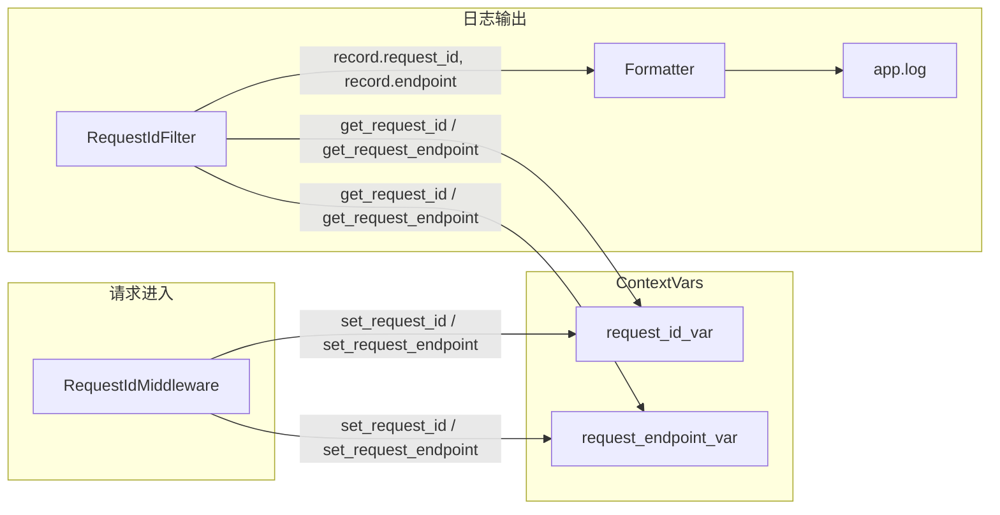

# SQL 日志关联触发接口实现计划

## 数据流概览

## 实现步骤

### 1. 扩展 request_id 模块，增加 endpoint 的 contextvars

**文件**: [backend/core/request_id.py](backend/core/request_id.py)

- 新增 `request_endpoint_var: ContextVar[Optional[str]]`
- 新增 `get_request_endpoint() -> Optional[str]`
- 新增 `set_request_endpoint(endpoint: str) -> None`
- 新增 `clear_request_endpoint() -> None`

### 2. 在 RequestIdMiddleware 中注入 endpoint

**文件**: [backend/middleware/request_id.py](backend/middleware/request_id.py)

- 在 `dispatch` 入口处，从 `request.method`、`request.url.path`、`request.query_params` 组装 endpoint
- 格式：`{METHOD} {path}`，path 含 query 时与 [access_log.py](backend/middleware/access_log.py) 一致：`path` 或 `path?{query_params}`
- 长度截断：超过 256 字符时截断并追加 `...`
- 在 `set_request_id(rid)` 之后调用 `set_request_endpoint(...)`
- 在 `finally` 中 `clear_request_id()` 之后调用 `clear_request_endpoint()`

### 3. 扩展 RequestIdFilter 并更新日志格式

**文件**: [backend/logging_config.py](backend/logging_config.py)

- **RequestIdFilter**：增加 `record.endpoint` 注入
  - 调用 `get_request_endpoint()`，有值时格式化为 `[GET /api/v1/history]`，无值时 `"-"`
- **default formatter**：format 由  
`%(request_id)s %(message)s`  
改为  
`%(request_id)s %(endpoint)s %(message)s`
- **access formatter**：保持不变（spec 明确不增加 endpoint）

### 4. 同步文档

**文件**: [docs/06_logging_guide.md](docs/06_logging_guide.md)

- 1. 日志架构：app.log 说明增加「含 endpoint（触发接口）」
- 1. 查看日志：增加 `grep "GET /api/v1/history" app.log` 示例
- 1. SQL 日志：补充「开启 LOG_SQL 后，SQL 日志行内会展示触发接口（如 `[GET /api/v1/history]`）」

**文件**: [spec/05_log_spec.md](spec/05_log_spec.md)

- 4.2 必含字段：增加 `endpoint` 行
- 4.2 应用层日志示例：更新为含 endpoint 的格式
- 5.2 日志中注入：由「注入 request_id」扩展为「注入 request_id 与 endpoint」

## 关键实现细节

| 项目          | 约定                                                     |
| ----------- | ------------------------------------------------------ |
| endpoint 格式 | `{METHOD} {path}`，如 `GET /api/v1/history?page=1`       |
| 日志展示格式      | 有上下文：`[GET /api/v1/history?page=1]`；无上下文：`-`           |
| path 组装     | 与 access_log 一致：`path` 或 `path?{request.query_params}` |
| 长度限制        | 256 字符，超出截断并加 `...`                                    |

## 不改动的部分

- access.log、access formatter：不增加 endpoint
- SQLAlchemy、database.py：无需修改
- .env / config：不新增配置项

