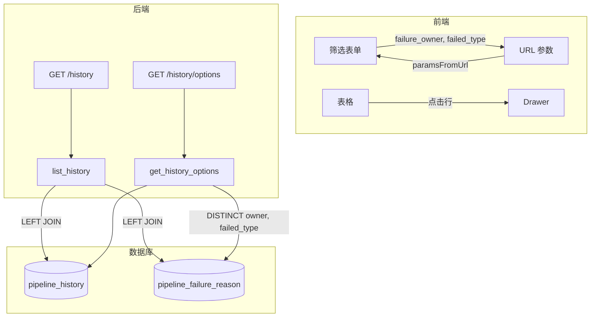

# 历史失败原因字段开发计划

依据 [spec/03_history_failure_reason_spec.md](spec/03_history_failure_reason_spec.md)，在现有 HistoryPage 与 history API 基础上，扩展 `pipeline_failure_reason` 关联字段的展示与筛选。

---

## 一、数据关联与实现策略

**关联条件：** `pipeline_history` 与 `pipeline_failure_reason` 通过三元组关联：

- `ph.case_name = pfr.case_name`
- `ph.start_time = pfr.failed_batch`
- `ph.platform = pfr.platform`

**方案：** 采用 Spec 推荐的 **方案 A：SQL LEFT JOIN**，一次查询返回主表 + 关联字段，无匹配时 `failure_owner`、`failed_type` 为 null，前端统一显示「—」。

---

## 二、后端改动

### 2.1 Schema 扩展

**文件：** [backend/schemas/history.py](backend/schemas/history.py)

- **HistoryItem** 新增可选字段：
  - `failure_owner: Optional[str] = None`（来自 `pipeline_failure_reason.owner`）
  - `failed_type: Optional[str] = None`（来自 `pipeline_failure_reason.failed_type`）
- **HistoryQuery** 新增筛选字段：
  - `failure_owner: Optional[List[str]] = None`
  - `failed_type: Optional[List[str]] = None`
- **HistoryFilterOptions** 新增：
  - `failure_owner: List[str] = []`
  - `failed_type: List[str] = []`

### 2.2 Service 扩展

**文件：** [backend/services/history_service.py](backend/services/history_service.py)

- 导入 `PipelineFailureReason` 及 `and`_
- **list_history** 改造：
  1. 使用 `select(PipelineHistory, PipelineFailureReason.owner.label("failure_owner"), PipelineFailureReason.failed_type)`
  2. `select_from(PipelineHistory).outerjoin(PipelineFailureReason, and_(ph.case_name==pfr.case_name, ph.start_time==pfr.failed_batch, ph.platform==pfr.platform))`
  3. 当 `query.failure_owner` 有值时，添加 `WHERE pfr.owner.in_(query.failure_owner)`（需在 JOIN 后施加，过滤无匹配记录）
  4. 当 `query.failed_type` 有值时，添加 `WHERE pfr.failed_type.in_(query.failed_type)`
  5. 返回值改为 `List[Tuple[PipelineHistory, Optional[str], Optional[str]]]`，API 层负责组装 `HistoryItem`
- **get_history_options** 扩展：
  - 从 `pipeline_failure_reason` 表执行 `_distinct(PipelineFailureReason.owner)`、`_distinct(PipelineFailureReason.failed_type)`，排除 null/空字符串
  - 返回的 `HistoryFilterOptions` 中填充 `failure_owner`、`failed_type`

### 2.3 API 扩展

**文件：** [backend/api/v1/history.py](backend/api/v1/history.py)

- `get_history_list` 新增 Query 参数：`failure_owner`、`failed_type`（均为 `Optional[List[str]]`）
- 将上述参数传入 `HistoryQuery`
- 组装响应时：对每个 `(ph, fo, ft)` 元组，使用 `HistoryItem.model_validate(ph).model_copy(update={"failure_owner": fo, "failed_type": ft})`

---

## 三、前端改动

### 3.1 Service 与类型

**文件：** [frontend/src/services/index.ts](frontend/src/services/index.ts)

- **HistoryItem** 新增：`failure_owner: string | null`、`failed_type: string | null`
- **HistoryQueryParams** 新增：`failure_owner?: string[]`、`failed_type?: string[]`
- **HistoryFilterOptions** 新增：`failure_owner: string[]`、`failed_type: string[]`
- **toSearchParams** 中增加 `appendList("failure_owner", ...)`、`appendList("failed_type", ...)`

### 3.2 表格列扩展

**文件：** [frontend/src/pages/history/HistoryPage.tsx](frontend/src/pages/history/HistoryPage.tsx)

- 在 **「执行结果」列之后、「用例级别」之前** 插入两列：

| 列标题  | dataIndex     | 宽度  | 渲染                                 |
| ---- | ------------- | --- | ---------------------------------- |
| 跟踪人  | failure_owner | 100 | 纯文本，无值显示「—」                        |
| 失败原因 | failed_type   | 140 | 纯文本，ellipsis 省略，无值显示「—」，可选 Tooltip |

- `DEFAULT_WIDTHS` 增加 `failure_owner: 100`、`failed_type: 140`
- 使用现有 `ellipsisCell` 处理空值（null/空字符串 → 「—」）

### 3.3 Drawer 失败归因区

**文件：** [frontend/src/pages/history/HistoryPage.tsx](frontend/src/pages/history/HistoryPage.tsx)

- 在「基本信息区」与「外部链接区」之间新增 **失败归因区**
- **仅当 `drawerRecord.case_result === 'failed'` 时渲染**，否则不显示该区
- 内容：跟踪人（`failure_owner`）、失败原因（`failed_type`），无值显示「—」

### 3.4 筛选扩展

**文件：** [frontend/src/pages/history/HistoryPage.tsx](frontend/src/pages/history/HistoryPage.tsx)

- 新增两个 Form.Item：**跟踪人**、**失败原因**
- 使用 `Select`（单选，`mode` 不设置或单值），`options` 来自 `options?.failure_owner`、`options?.failed_type`
- `paramsFromUrl`、`syncParamsToUrl`、`handleFilterChange`、`form.setFieldsValue` 中增加 `failure_owner`、`failed_type` 的读写
- 筛选控件 **始终展示**，不随「执行结果」变化而隐藏

---

## 四、空值策略

- 后端：无关联记录或字段为空时，返回 `null`
- 前端：`failure_owner`、`failed_type` 为 `null` 或空字符串时，统一渲染为「—」

---

## 五、文件变更清单

| 层级         | 文件                                           | 变更内容                                             |
| ---------- | -------------------------------------------- | ------------------------------------------------ |
| Schema     | `backend/schemas/history.py`                 | HistoryItem/HistoryQuery/HistoryFilterOptions 扩展 |
| Service    | `backend/services/history_service.py`        | LEFT JOIN、筛选条件、options 扩展                        |
| API        | `backend/api/v1/history.py`                  | Query 参数、响应组装                                    |
| 前端 Service | `frontend/src/services/index.ts`             | 类型与 toSearchParams                               |
| 前端 Page    | `frontend/src/pages/history/HistoryPage.tsx` | 表格列、Drawer 区、筛选、URL 同步                           |

---

## 六、数据流示意

