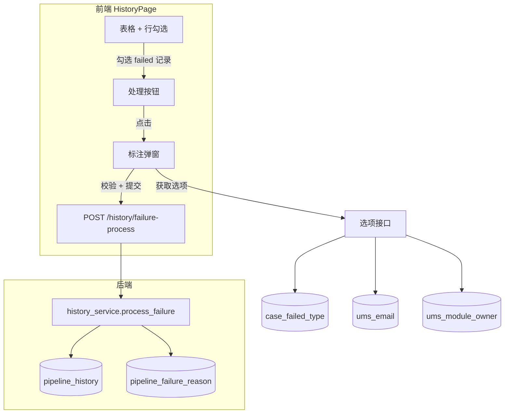

# 失败记录标注功能开发计划

## 一、功能架构概览

---

## 二、后端开发

### 2.1 新增选项接口（标注弹窗所需数据）

**路径**：`GET /api/v1/history/failure-process-options`

**返回结构**（新建 Schema `FailureProcessOptions`）：

- `case_failed_types`: `[{ id, failed_reason_type, owner }]` — 来自 `case_failed_type`，按 id 或字母排序
- `owners`: `[{ employee_id, name }]` — 来自 `ums_email`
- `modules`: `[{ module, owner }]` — 来自 `ums_module_owner`

**实现**：

- 新建 [backend/schemas/failure_process.py](backend/schemas/failure_process.py)：`FailureProcessOptions`、`FailureProcessRequest`
- 新建 [backend/services/failure_process_service.py](backend/services/failure_process_service.py)：`get_failure_process_options()`
- 在 [backend/api/v1/history.py](backend/api/v1/history.py) 新增 `GET /failure-process-options` 端点

### 2.2 失败标注提交接口

**路径**：`POST /api/v1/history/failure-process`

**请求体**（`FailureProcessRequest`）：

| 字段          | 类型         | 必填  | 说明                                     |
| ----------- | ---------- | --- | -------------------------------------- |
| history_ids | array[int] | 是   | pipeline_history.id 列表                 |
| failed_type | string     | 是   | 来自 case_failed_type.failed_reason_type |
| owner       | string     | 是   | 跟踪人工号 (ums_email.employee_id)          |
| reason      | string     | 是   | 详细失败原因                                 |
| module      | string     | 条件  | failed_type 为 bug 时必填                  |

**后端校验**：

- `history_ids` 对应记录存在且 `case_result = 'failed'`
- `failed_type`、`owner`、`reason` 非空
- 当 `failed_type` 与 `'bug'` 忽略首尾空格、大小写匹配时，`module` 必填

**业务逻辑**（`process_failure`）：

1. 遍历 `history_ids`，校验记录存在且 `case_result = 'failed'`
2. 更新 `pipeline_history.analyzed = 1`
3. 对每条记录，按 `(case_name, start_time, platform)` 与 `(case_name, failed_batch, platform)` 匹配 `pipeline_failure_reason`：
  - 无记录 → INSERT
  - 有记录 → UPDATE
4. `analyzer` 写入当前登录用户 `employee_id`（通过 `Depends(get_current_user)` 获取）

**认证**：接口需 `Depends(get_current_user)`，未登录返回 401

---

## 三、前端开发

### 3.1 表格行勾选

**修改** [frontend/src/pages/history/HistoryPage.tsx](frontend/src/pages/history/HistoryPage.tsx)：

- 在首列增加 Checkbox，**仅对 `case_result === 'failed'` 的行启用**（方案 A）
- 使用 `rowSelection` 配置 Table，`getCheckboxProps: (record) => ({ disabled: record.case_result !== 'failed' })`
- 表头 Checkbox 实现「全选当前页」
- 切换分页时清空勾选状态（`handleTableChange` 中重置 `selectedRowKeys`）

### 3.2 处理按钮

- 位置：筛选区域右侧，与「确认」「重置」同一行或相邻
- 状态：`selectedRowKeys.length > 0` 且勾选记录中至少一条 `case_result === 'failed'` 时可用
- 点击后打开标注弹窗

### 3.3 标注弹窗

**布局**：

- 标题：「失败记录标注」
- 宽度：500px
- 字段顺序：失败类型 → 跟踪人 → 详细原因 → 模块（条件显示）

**字段与联动**：

- **失败类型**：Select，选项来自 `case_failed_types`，必填；选择后根据 `case_failed_type.owner` 更新跟踪人默认值
- **跟踪人**：Select，选项来自 `owners`（展示 name，提交 employee_id），必填；当失败类型为 bug 且已选模块时，默认值改为 `ums_module_owner.owner`
- **详细原因**：TextArea，必填，maxLength 2000
- **模块**：仅当失败类型与 `'bug'` 忽略首尾空格、大小写匹配时显示；默认值取**第一条勾选记录的 `main_module`**（方案 B）

**bug 匹配规则**：`failed_reason_type.trim().toLowerCase() === 'bug'`

**校验**：必填项未填时对应提示（「请选择失败类型」「请选择跟踪人」「请输入详细原因」「请选择模块」）

**确定行为**：前端校验 → 调用 `POST /history/failure-process` → 成功则关闭弹窗、刷新表格；失败则展示错误信息，弹窗保持打开

### 3.4 前端 Service

**修改** [frontend/src/services/index.ts](frontend/src/services/index.ts)（或新建 history 相关 service 文件）：

- `failureProcessOptions()`: `GET /history/failure-process-options`
- `failureProcess(data)`: `POST /history/failure-process`，需携带 token（request 已自动注入）

---

## 四、数据流与关键实现点

### 4.1 模块默认值（方案 B）

勾选多条记录时，模块默认值 = 第一条勾选记录的 `main_module`。需在打开弹窗时，从 `data` 中按 `selectedRowKeys` 取第一条记录的 `main_module` 填入表单。

### 4.2 提交防抖

确定按钮点击后，可设置 `loading` 或 `disabled`，避免重复提交。

### 4.3 刷新策略

提交成功后，使用当前 `paramsFromUrl()` 重新调用 `fetchData()`，保持分页与筛选条件不变，表格与 Drawer 数据自然更新。

---

## 五、依赖与约束

- **case_failed_type 种子数据**：若表为空，需准备 seed 或通过管理端维护；至少需包含 `bug` 类型以验证模块联动
- **认证**：`POST /history/failure-process` 需登录；`GET /failure-process-options` 可考虑与列表一致（若列表需登录则同）
- **数据库红线**：不 ALTER/DROP 已有表，不 DELETE pipeline_history；仅 INSERT/UPDATE pipeline_failure_reason，UPDATE pipeline_history.analyzed

---

## 六、文件变更清单

| 操作  | 路径                                                                         |
| --- | -------------------------------------------------------------------------- |
| 新建  | `backend/schemas/failure_process.py`                                       |
| 新建  | `backend/services/failure_process_service.py`                              |
| 修改  | `backend/api/v1/history.py` — 新增 2 个端点                                     |
| 修改  | `frontend/src/pages/history/HistoryPage.tsx` — 勾选、按钮、弹窗                    |
| 修改  | `frontend/src/services/index.ts` — 新增 failureProcessOptions、failureProcess |

---

## 七、可选后续

- 若 `case_failed_type` 无种子数据，可新增 `database/seed_case_failed_type.sql`（需符合项目 SQL 规范）
- 文档同步：若 `docs/` 有 API 或页面说明，需同步更新

