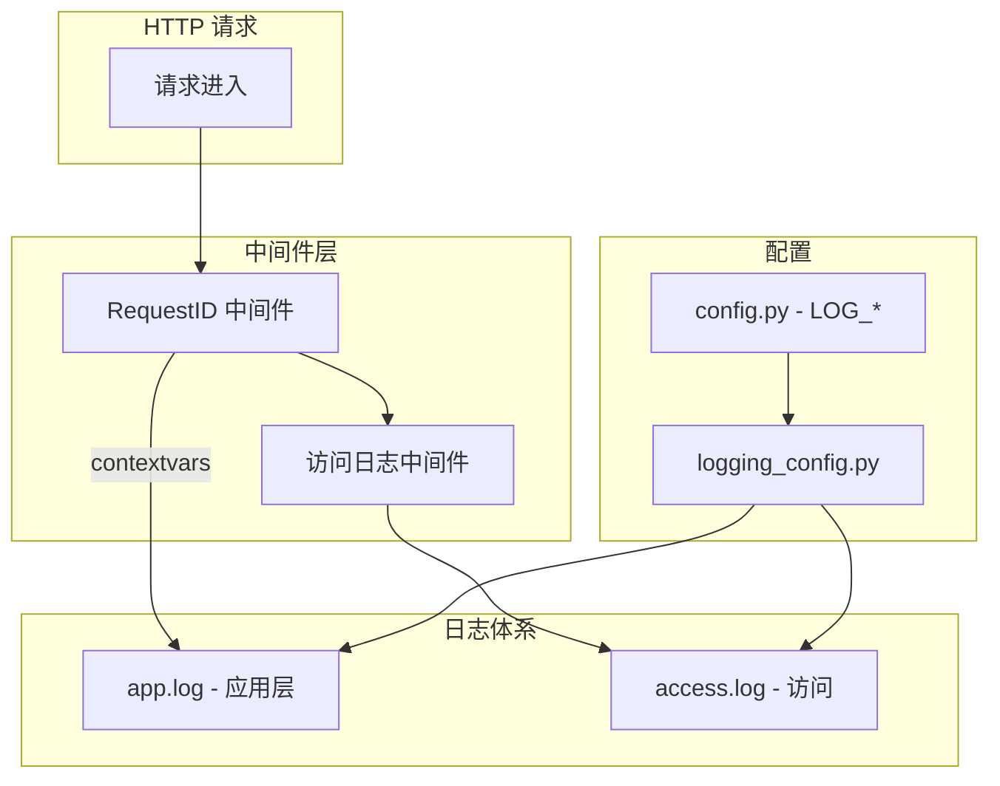

# 日志功能开发计划

根据 [spec/05_log_spec.md](spec/05_log_spec.md) 实现 dt-report 的完整日志体系。

---

## 架构概览

---

## 1. 配置扩展

**文件**: [backend/core/config.py](backend/core/config.py)

新增日志相关配置项（从 `.env` 读取，不硬编码）：

| 配置项                     | 类型  | 默认值           | 说明                             |
| ----------------------- | --- | ------------- | ------------------------------ |
| ENV                     | str | "development" | development / production       |
| LOG_LEVEL               | str | 随 ENV         | DEBUG / INFO / WARNING / ERROR |
| LOG_DIR                 | str | ""            | 空则项目根目录                        |
| LOG_APP_MAX_BYTES       | int | 10485760      | 10MB                           |
| LOG_APP_BACKUP_COUNT    | int | 5             | app.log 保留份数                   |
| LOG_ACCESS_MAX_BYTES    | int | 10485760      | 10MB                           |
| LOG_ACCESS_BACKUP_COUNT | int | 3             | access.log 保留份数                |

**文件**: [.env.example](.env.example)  
追加上述配置项及注释。

---

## 2. 日志配置模块

**新建**: `backend/logging_config.py`

- 使用 `logging.config.dictConfig` 的字典结构，在 Python 代码中构建配置
- 根据 `settings.ENV`、`settings.LOG_LEVEL` 等动态生成配置
- 定义两类 Handler：
  - **app_handler**：`RotatingFileHandler` 写 `app.log`，格式 `%(asctime)s [%(levelname)s] [%(name)s] %(message)s`（含 request_id 时通过 Filter 注入）
  - **access_handler**：`RotatingFileHandler` 写 `access.log`，由访问日志中间件使用独立 logger
- 定义 Formatter：时间戳 `%Y-%m-%d %H:%M:%S.%(msecs)03d`，级别、logger、message
- 配置 logger：`uvicorn`、`uvicorn.access`、`uvicorn.error`、`backend` 及子模块
- 开发环境：增加 `StreamHandler` 输出到控制台（可选颜色）
- 生产环境：仅文件输出
- 导出函数 `get_logging_config() -> dict` 供 uvicorn 使用

**自定义 Formatter / Filter**：

- `RequestIdFilter`：从 `contextvars` 读取 `request_id`，注入到 `record.request_id`，Formatter 中 `%(request_id)s` 显示为 `[req:xxx]` 或 `-`
- `SensitiveDataFilter`（可选，可后续迭代）：对 `password`、`token`、`Authorization` 等做脱敏替换

---

## 3. Request ID 与 contextvars

**新建**: `backend/core/request_id.py`

- 定义 `request_id_var: ContextVar[Optional[str]]`
- 函数 `get_request_id() -> Optional[str]`
- 函数 `set_request_id(rid: str) -> None`

**新建**: `backend/middleware/request_id.py`（或放在 `backend/core/`）

- 中间件：请求进入时生成 UUID4，调用 `set_request_id`，写入 `request.state.request_id`
- 响应时在响应头添加 `X-Request-ID`
- 请求结束后清理 contextvar

---

## 4. 访问日志中间件

**新建**: `backend/middleware/access_log.py`

- 记录：method、path（含 query）、status_code、duration_ms、client_ip、user_agent（可截断）、request_id
- 使用独立 logger（如 `access`），写入 `access.log`
- 敏感路径（如 `/api/v1/auth/login`）：不记录请求体，仅记录「请求到达」「响应状态」等摘要
- 在 `RequestIdFilter` 之后执行，确保 request_id 已注入

---

## 5. 全局异常处理与日志

**修改**: [backend/main.py](backend/main.py)

- 注册 `RequestIdMiddleware`、`AccessLogMiddleware`（顺序：RequestId 先于 AccessLog）
- 注册全局异常处理器：捕获未处理异常，使用 `logger.exception()` 记录完整 traceback，并返回 500
- 在应用启动时调用 `logging.config.dictConfig(get_logging_config())`，确保在 uvicorn 启动前完成（若通过 run.py 启动则可在 run.py 中先加载）

---

## 6. 启动方式调整

**新建**: `backend/run.py` 或 `run.py`（项目根目录）

- 在加载 `backend.main:app` 之前，先执行 `dictConfig(get_logging_config())`
- 调用 `uvicorn.run("backend.main:app", host="0.0.0.0", port=8000, log_config=get_logging_config())`
- 端口可从环境变量读取，默认 8000

**修改**: [scripts/start.sh](scripts/start.sh)

- 移除 `>> "$LOG_FILE" 2>&1` 重定向
- 将启动命令改为：`python -m backend.run` 或 `uvicorn backend.main:app ... --log-config <path>`
- 若使用 `backend.run`：`nohup "$PROJECT_DIR/.venv/bin/python" -m backend.run ... &`
- 保留 `LOG_FILE` 变量用于提示用户（如 `echo "[dt-report] 日志: app.log, access.log"`）

**说明**：uvicorn 的 `--log-config` 接受文件路径（JSON/YAML）。若采用 Python dictConfig，需通过 `uvicorn.run(log_config=dict)` 传入，故使用 `backend.run` 作为入口更合适。

---

## 7. 应用层日志打点

| 位置                                                                                                           | 级别      | 内容                                                       |
| ------------------------------------------------------------------------------------------------------------ | ------- | -------------------------------------------------------- |
| [backend/services/auth_service.py](backend/services/auth_service.py) `authenticate_user`                     | INFO    | 登录成功：employee_id、role                                    |
| [backend/services/auth_service.py](backend/services/auth_service.py) `authenticate_user`                     | WARNING | 登录失败：employee_id、原因（账号不存在/密码错误），不记录密码                    |
| [backend/services/failure_process_service.py](backend/services/failure_process_service.py) `process_failure` | INFO    | 标注成功：记录数、failed_type、owner（脱敏）、analyzer                  |
| [backend/services/failure_process_service.py](backend/services/failure_process_service.py) `process_failure` | ERROR   | 标注失败（异常时）：原因、request_id                                  |
| [backend/core/database.py](backend/core/database.py) `get_db`                                                | ERROR   | 数据库连接/会话异常时记录（可在 engine 的 event 或 get_db 的 try/except 中） |

各模块使用 `logger = logging.getLogger(__name__)` 获取 logger，确保 logger 名称为 `backend.xxx`。

---

## 8. 敏感信息过滤

- **Formatter 层**：在自定义 Formatter 或 Filter 中对 `message` 做正则替换，将 `password=xxx`、`Authorization: Bearer xxx` 等替换为 `*`**
- **业务层**：打日志时避免传入密码、Token，仅传「登录失败」「标注成功」等摘要
- **访问日志**：对 `/api/v1/auth/login` 不记录请求体

---

## 9. 文档同步

| 文档                                                           | 变更                                                                                                    |
| ------------------------------------------------------------ | ----------------------------------------------------------------------------------------------------- |
| [docs/03_deployment_guide.md](docs/03_deployment_guide.md)   | 6.3 节：补充 access.log、轮转说明；「查看实时日志」示例                                                                   |
| [docs/04_project_structure.md](docs/04_project_structure.md) | 根目录 app.log 说明 → 补充 access.log；start.sh 说明 → 改为「由 Python logging 写入」；新增 logging_config、middleware 等说明 |
| [README.md](README.md)                                       | 若有日志相关描述则同步                                                                                           |

---

## 10. 实现顺序建议

1. **配置**：config.py、.env.example
2. **日志配置模块**：logging_config.py（含 Formatter、Filter、RotatingFileHandler）
3. **Request ID**：request_id.py、RequestIdMiddleware
4. **访问日志**：AccessLogMiddleware
5. **main.py**：注册中间件、全局异常处理、启动时 dictConfig
6. **run.py + start.sh**：调整启动方式，移除重定向
7. **应用层打点**：auth_service、failure_process_service、database
8. **敏感信息过滤**：Formatter/Filter 脱敏
9. **文档**：docs 同步

---

## 11. 关键文件清单

| 操作  | 文件路径                                        |
| --- | ------------------------------------------- |
| 修改  | backend/core/config.py                      |
| 新建  | backend/logging_config.py                   |
| 新建  | backend/core/request_id.py                  |
| 新建  | backend/middleware/request_id.py            |
| 新建  | backend/middleware/access_log.py            |
| 修改  | backend/main.py                             |
| 新建  | backend/run.py 或 run.py                     |
| 修改  | scripts/start.sh                            |
| 修改  | backend/services/auth_service.py            |
| 修改  | backend/services/failure_process_service.py |
| 修改  | backend/core/database.py（可选，连接异常打点）         |
| 修改  | .env.example                                |
| 修改  | docs/03_deployment_guide.md                 |
| 修改  | docs/04_project_structure.md                |

