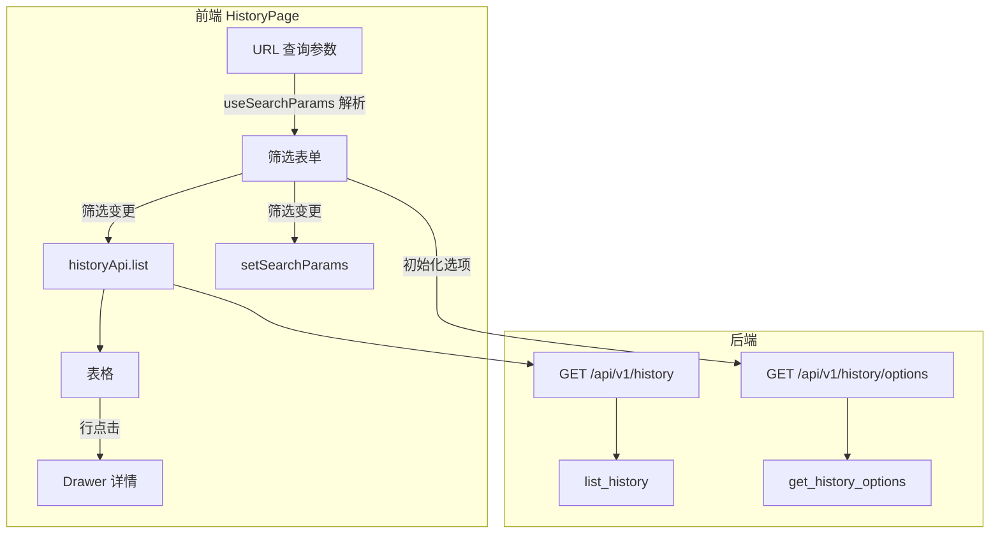

# 详细执行历史 Spec 开发计划

依据 [docs/06_history_fields_spec.md](docs/06_history_fields_spec.md)，在现有 HistoryPage 与 history API 基础上补齐表格列、Drawer、筛选与 URL 同步。

---

## 一、现状与规约差异

| 能力     | 现状                                | 规约要求                                                                                                           |
| ------ | --------------------------------- | -------------------------------------------------------------------------------------------------------------- |
| 表格列    | 9 列，含 created_at                  | 12 列：批次、分组、用例名、主模块、执行结果、用例级别、负责人、是否已分析、平台、代码分支、截图、测试报告；移除 created_at                                           |
| Drawer | 无                                 | 点击行弹出：基本信息区 + 外部链接区                                                                                            |
| 筛选     | 无                                 | 10 个筛选：start_time、subtask、case_name(模糊)、main_module、case_result、case_level、owner、analyzed、platform、code_branch |
| URL 同步 | 无                                 | 筛选条件写入 URL 查询参数，支持 deeplink                                                                                    |
| 后端筛选   | 仅 start_time、case_result、platform | 支持全部 10 个筛选，case_name 支持 `LIKE %keyword%`                                                                      |

---

## 二、后端改动

### 2.1 Schema 扩展

**文件：** [backend/schemas/history.py](backend/schemas/history.py)

- 在 `HistoryQuery` 中新增可选字段：`subtask`、`case_name`、`main_module`、`case_level`、`owner`、`analyzed`、`code_branch`
- `analyzed` 类型为 `Optional[int]`，对应 空/1/0（全部/已分析/未分析）

### 2.2 Service 扩展

**文件：** [backend/services/history_service.py](backend/services/history_service.py)

- 在 `list_history` 中为所有新增筛选字段添加 `.where()` 条件
- `case_name` 使用 `PipelineHistory.case_name.like(f"%{keyword}%")` 实现模糊搜索
- `analyzed` 为 `None` 时不过滤，为 1/0 时精确匹配

### 2.3 API 扩展

**文件：** [backend/api/v1/history.py](backend/api/v1/history.py)

- 在 `get_history_list` 中增加 Query 参数：`subtask`、`case_name`、`main_module`、`case_level`、`owner`、`analyzed`、`code_branch`
- 将上述参数传入 `HistoryQuery` 并调用 `list_history`

### 2.4 筛选选项接口（新增）

**新增：** `GET /api/v1/history/options`

- 返回各筛选字段的去重选项，供前端 Select 使用
- 响应结构示例：`{ "start_time": [...], "subtask": [...], "main_module": [...], "case_result": ["passed","failed"], "case_level": [...], "owner": [...], "platform": [...], "code_branch": [...] }`
- 实现方式：对 `pipeline_history` 各列执行 `SELECT DISTINCT col FROM pipeline_history WHERE col IS NOT NULL AND col != '' ORDER BY col`，`case_result` 固定返回 `["passed","failed"]`
- 选项接口无需鉴权（与 list 一致，普通用户可访问）

---

## 三、前端改动

### 3.1 Service 层

**文件：** [frontend/src/services/index.ts](frontend/src/services/index.ts)

- 扩展 `HistoryQueryParams`：增加 `subtask`、`case_name`、`main_module`、`case_level`、`owner`、`analyzed`、`code_branch`
- 新增 `historyApi.options()`：`GET /api/v1/history/options`，返回 `HistoryFilterOptions` 类型

### 3.2 HistoryPage 表格列

**文件：** [frontend/src/pages/history/HistoryPage.tsx](frontend/src/pages/history/HistoryPage.tsx)

按 spec 调整列：

| 列标题   | dataIndex      | 宽度  | 渲染                               |
| ----- | -------------- | --- | -------------------------------- |
| 批次    | start_time     | 180 | 纯文本                              |
| 分组    | subtask        | 100 | 纯文本                              |
| 用例名   | case_name      | 200 | 纯文本，ellipsis                     |
| 主模块   | main_module    | 100 | 纯文本                              |
| 执行结果  | case_result    | 100 | Tag：passed=绿，failed=红，其他=default |
| 用例级别  | case_level     | 90  | 纯文本                              |
| 负责人   | owner          | 90  | 纯文本                              |
| 是否已分析 | analyzed       | 100 | Tag：1=已分析(蓝)，0=未分析(灰)            |
| 平台    | platform       | 90  | 纯文本                              |
| 代码分支  | code_branch    | 120 | 纯文本，ellipsis                     |
| 截图    | screenshot_url | 120 | 链接或「暂无」                          |
| 测试报告  | reports_url    | 120 | 链接或「暂无」                          |

移除 `created_at` 列。

### 3.3 Drawer 详情弹窗

- 行点击时打开 Ant Design `Drawer`
- **基本信息区**：case_name、start_time、subtask、main_module、module、case_level、platform、code_branch、screenshot_url、reports_url（链接或「暂无」）
- **外部链接区**：log_url、pipeline_url（链接或「暂无」）
- 使用 `Descriptions` 或 `Space` + `Typography` 布局

### 3.4 筛选区域

- 使用 `Form` + `Row`/`Col` + `Select`/`Input` 布局
- 筛选控件与 spec 对应：
  - start_time、subtask、main_module、case_result、case_level、owner、analyzed、platform、code_branch → `Select`，选项来自 `historyApi.options()`
  - case_name → `Input.Search` 或 `Input` + 搜索按钮，触发模糊搜索
- analyzed 选项：全部(空)、已分析(1)、未分析(0)
- 筛选变更时：更新 state → 调用 `historyApi.list(params)` → 同时用 `useSearchParams` 写入 URL

### 3.5 URL 同步（deeplink）

- 使用 `useSearchParams` 读写 URL 查询参数
- 页面加载时：从 URL 解析筛选条件，初始化表单并请求数据
- 筛选变更时：`setSearchParams` 更新 URL，保持与表单一致
- 支持直接访问如 `/history?case_result=failed&platform=iOS` 一键跳转

---

## 四、数据流示意

---

## 五、实现顺序建议

1. **后端**：Schema → Service → API（含 options 接口）
2. **前端 Service**：扩展 `HistoryQueryParams`，新增 `historyApi.options()`
3. **前端页面**：表格列调整 → 筛选区域 + URL 同步 → Drawer

---

## 六、不实现范围（按 spec 明确排除）

- `pipeline_failure_reason` 关联
- 归因分析区、流转操作区、操作时间线
- `owner_history` 展示
- `ums_module_owner` / `ums_email` 作为选项来源（本次统一用 pipeline_history 去重）

---

## 七、文档同步

- 若 [docs/04_project_structure.md](docs/04_project_structure.md) 或 [docs/05_technical_architecture.md](docs/05_technical_architecture.md) 中描述 history 能力与本次实现不一致，需在同次变更中更新。

