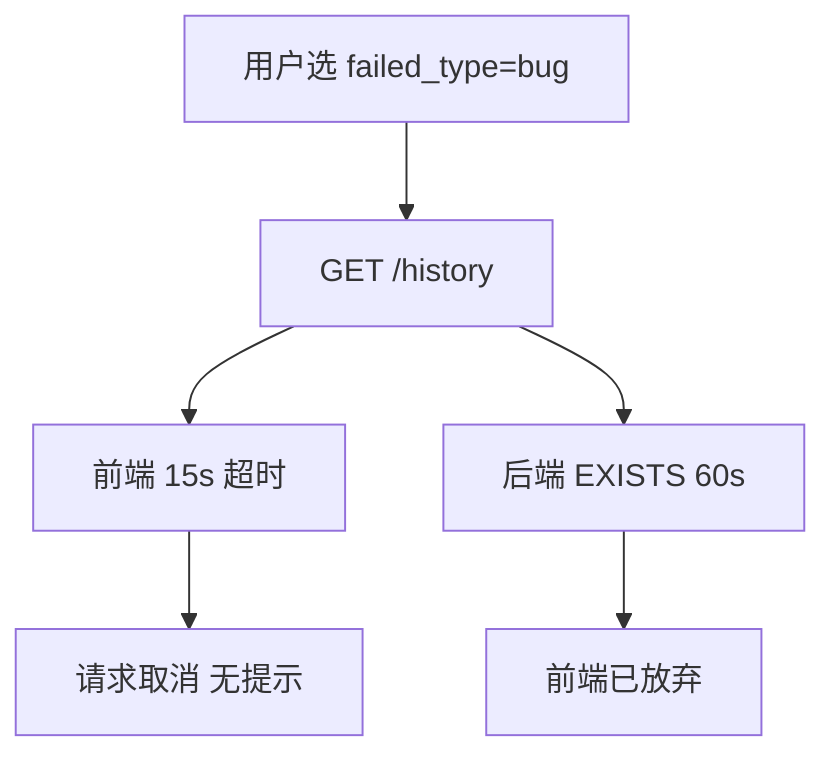

# History 模块筛选性能优化规约（Spec）

> 本文档定义 History 列表筛选的性能优化实现规格，包含问题分析、设计约束及可落地的实现要求。配套 [spec/07_history_filter_query_spec.md](07_history_filter_query_spec.md)。

---

## 一、问题描述

### 1.1 现象

| 场景 | 表现 |
|------|------|
| 筛选条件 | 用户仅选择 `failed_type = 'bug'`，未设置其他筛选（如 start_time、platform） |
| 数据规模 | 查询涉及几万至几十万条记录 |
| 查询耗时 | 约 60,000ms（60 秒） |
| 前端表现 | 页面无报错，但筛选结果未更新 |
| 用户体验 | 无法感知筛选失败，误以为系统无响应或数据为空 |

### 1.2 根因概要

- 前端 axios 超时 15s，后端 60s 才返回，请求被提前取消
- `fetchData` 无 `catch`，超时/失败时用户无任何提示
- 仅跨表条件时主表扫描范围大，EXISTS + COUNT 耗时高

---

## 二、设计约束

### 2.1 默认主表条件的适用边界

| 查询类型 | 说明 | 是否注入默认主表条件 |
|----------|------|----------------------|
| **列表型** | History 列表页 `GET /api/v1/history` | ✅ 允许 |
| **点查型** | 用例历史详情（按 case_name + platform） | ❌ 禁止 |

点查型具备高选择性条件，不得注入默认时间，否则会错误缩小结果集。

### 2.2 分页后二次查询 IN 的约束

| 类型 | 说明 |
|------|------|
| ❌ 禁止 | 结果集驱动、不可控膨胀的 IN（如 4000+ case_name 拼进筛选） |
| ✅ 允许 | 分页后、受控规模的拼装型 IN（当前页 ≤ page_size 条，用于查 pfr 拼装） |

---

## 三、实现规格（可落地）

### 3.1 后端：默认 start_time 注入（仅列表型）

**适用接口**：`GET /api/v1/history`（`list_history` Service）

**触发条件**：用户**未选择** `start_time` 时即注入（与是否选择其他筛选项无关）

- 覆盖场景：仅选 failed_type、仅选 case_result、仅选 platform、仅选 main_module 等任意组合，只要未选 start_time 均注入
- 目的：避免任意「无批次」筛选导致全表/大范围扫描超时

**注入逻辑**：

1. 查询 `pipeline_history` 中 `start_time` 的最近 N 个不重复值
2. SQL 示例：`SELECT DISTINCT start_time FROM pipeline_history WHERE start_time LIKE '20%' ORDER BY start_time DESC LIMIT N`
3. N 的取值：30（常量，可配置）
4. 将查询结果作为 `start_time IN (...)` 条件注入主查询，与用户选择的其他条件 AND 组合

**不触发**：若用户已选 start_time，则按用户选择查询，不注入。

### 3.1.1 例外：已选用例名且无批次（全时间范围）

**目的**：支持「按用例名查看该用例在全时间范围内的执行历史」（含 [spec/12_history_case_drilldown_spec.md](12_history_case_drilldown_spec.md) 钻取页），避免被默认 30 批截断。

**条件**（同时满足）：

1. 请求中 **`start_time` 未传或为空列表**（用户未选批次）；
2. 请求中 **`case_name` 为非空列表**，且经 trim 后至少包含一个**非空**用例名字符串。

**行为**：**不执行** §3.1 的「最近 N 批」注入逻辑；主查询仅在其它已选条件（含 `case_name IN (...)`）下按分页执行，时间范围为库内全表（仍受索引、超时与分页限制）。

**不满足上述条件时**：仍按 §3.1，在未选 `start_time` 时注入最近 N 批。

**关联规约**：分组执行历史（`pipeline_overview`，`GET /api/v1/overview`）在未选批次时的默认轮次注入与 §3.1 **思路相同**（`LIKE '20%'`、`ORDER BY` 降序取最近 N 个不重复轮次），主表为 `pipeline_overview`、字段为 **`batch`**，**`N = 30`**（与 History 的 `start_time` 批次数一致）。详见 [spec/14_overview_group_history_spec.md](14_overview_group_history_spec.md)。

### 3.2 前端：批次筛选 placeholder 提示

**修改位置**：`HistoryPage.tsx` 中批次（start_time）的 `Select` 组件

**实现要求**：

| 项目 | 规约 |
|------|------|
| placeholder | 将「全部」改为「不选则默认最近30批」 |
| 目的 | 告知用户未选批次时的默认行为，避免误解 |

### 3.3 前端：fetchData 错误处理

**修改位置**：`HistoryPage.tsx` 中 `fetchData` 函数

**实现要求**：

| 项目 | 规约 |
|------|------|
| 增加 catch | `try/catch/finally`，catch 中处理异常 |
| 错误提示 | 调用 `message.error()` 展示提示，文案见下表 |
| 数据保留 | 请求失败时**不调用** `setData`、`setTotal`，保留上次数据 |
| loading | `finally` 中 `setLoading(false)`，与现有逻辑一致 |

**错误提示文案**：

| 错误类型 | 判断条件 | 提示文案 |
|----------|----------|----------|
| 请求超时 | `error.code === 'ECONNABORTED'` 或 `error.message` 含 timeout | 请求超时，请缩小筛选范围（如选择批次或平台）后重试 |
| 服务异常 | `error.response?.status >= 500` | 服务异常，请稍后重试 |
| 客户端错误 | `error.response?.status >= 400` | 使用 `error.response?.data?.detail` 或「加载失败」 |
| 其他 | 上述均不满足 | `error.message` 或「加载失败」 |

### 3.4 验收标准

| 序号 | 验收项 |
|------|--------|
| 1 | 未选 start_time 时（无论其他筛选项如何），后端自动注入最近 30 批，查询在 15s 内返回 |
| 2 | 已选 start_time 时，不注入，按用户选择查询 |
| 3 | 批次 Select 的 placeholder 为「不选则默认最近30批」 |
| 4 | 列表请求超时或失败时，前端弹出 `message.error` 提示 |
| 5 | 请求失败时，表格保留上次数据，不出现空白 |

---

## 四、问题分析（参考）

### 4.1 根因链路

### 4.2 性能瓶颈

| 层级 | 瓶颈 |
|------|------|
| 数据库 | 无主表条件时主表扫描范围大 |
| 前端 | 15s 超时、无错误提示 |

---

## 五、中期优化（非本次实现）

| 措施 | 说明 |
|------|------|
| 延迟 COUNT | 先取当前页，total 用估算或「超过 N 条」 |
| 查询超时 | 数据库/ORM 层 statement_timeout 30s |
| 长时间加载提示 | 超过 5s 显示「数据量较大，请稍候」 |

---

## 六、版本与变更

| 版本 | 日期 | 说明 |
|------|------|------|
| 1.0 | 2025-03 | 初版：问题分析、设计约束、实现规格、验收标准 |
| 1.1 | 2025-03 | 扩展注入规则：未选 start_time 即注入；新增批次 placeholder 提示 |
| 1.2 | 2026-03-23 | 新增 §3.1.1：已选非空 case_name 且无 start_time 时不注入 N 批（配合 spec/12 用例钻取） |
| 1.3 | 2026-04-11 | §3.1 末新增关联规约：分组执行历史默认批次注入见 spec/14（表 pipeline_overview） |
| 1.4 | 2026-04-11 | 关联规约修订：分组执行历史默认 N 批与 History 一致为 **30**（原 spec/14 曾约定 20） |
